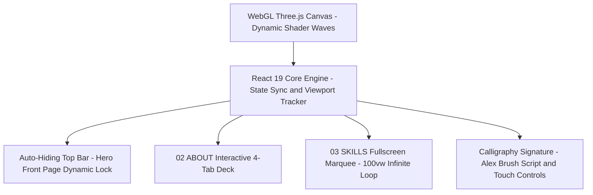

# A Gourav — 3D WebGL Portfolio & Research

<div align="center">

[](https://portfolio-lime-six-9sktsk3gk.vercel.app)
[](https://react.dev)
[](https://threejs.org)
[](https://vitejs.dev)
[](https://pytorch.org)

</div>

---

### 🌐 System Architecture



---

### ✨ Key Visual & Interactive Features

| Feature | Dynamic Behavior | Implementation Details |
| :--- | :--- | :--- |
| **🌌 Fast Cyan Aurora Background** | Non-blocking WebGL Shader rendering smooth fluid drifting wave motion. | Custom Three.js geometry & GPU fragment shaders |
| **🛸 Smart Header Auto-Hide** | Floating top pill bar auto-hides past hero threshold (`scrollY > 120`) & re-appears on scroll top. | React Scroll Listeners with CSS translate3d transitions |
| **🃏 Interactive 4-Tab About Card** | Switch between `01 BRIEF`, `02 EDU` (Batch 2024-2028), `03 STATS`, and `04 QUOTE` ("Stay GOATED 🐐"). | Modern corner reticle brackets `[ ]` & state deck |
| **♾️ Continuous 100vw Skills Marquee** | Full edge-to-edge infinite marquee scrolling without box clipping or side gaps. | 4x duplicated track arrays & CSS Keyframe translateX |
| **✒️ Calligraphy & Touch Interface** | Authentic script typography for signature with native touch-screen feel. | `Alex Brush` Google font & direct touch physics |

---

### 🛠️ Quick Start

```bash
# 1. Clone Repository
git clone https://github.com/arisu2006/portfolio.git

# 2. Install Dependencies
npm install

# 3. Launch Local Dev Server
npm run dev

# 4. Build for Production
npm run build
```

---

<div align="center">

> **"Stay GOATED 🐐"** — *A Gourav*

<p>Built with 💙 by <b>A Gourav</b> • Deployed on <b>Vercel</b></p>

</div>
